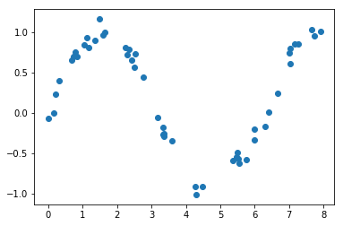
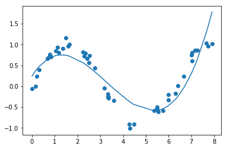
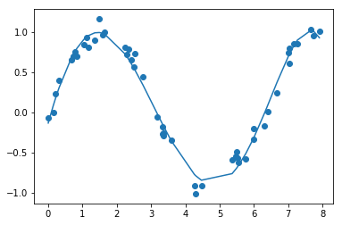
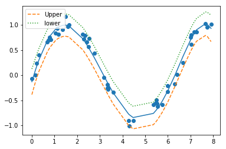

# Introduction to Polynomial Regression in python

Polynomial regression is a type of linear regression. In this technique relationship between independent variable X and dependent variable Y , modelled on the nth order polynomial. In essense polynomial regression tries to find a non-linear relationship between X and Y.
Let's implement Polynomial Regression using statsmodel.

### Import basic packages


```python
import numpy as np
import matplotlib.pyplot as plt
import pandas as pd
```

### Create simulated data


```python
rng = np.random.RandomState(1)
x = 8 * rng.rand(50)
y = np.sin(x) + 0.1 * rng.randn(50)

#Create single dimension
x= x[:,np.newaxis]
y= y[:,np.newaxis]

inds = x.ravel().argsort()  # Sort x values and get index
x = x.ravel()[inds].reshape(-1,1)
y = y[inds] #Sort y according to x sorted index

print(x.shape)
print(y.shape)

#Plot
plt.scatter(x,y)
```

    (50, 1)
    (50, 1)


    <matplotlib.collections.PathCollection at 0x28ff0ef5550>





### Running simple linear Regression using statsmodel OLS

Although simple linear line won't fit our $x$ data still let's see how it performs.

$$ y  = b_0+ b_1x $$

where $b_0$ is bias and $ b_1$ is weight for simple Linear Regression equation.

Statsmodel provides [OLS model](https://www.statsmodels.org/dev/generated/statsmodels.regression.linear_model.OLS.html) (ordinary Least Sqaures) for simple linear regression.


```python
import statsmodels.api as sm

model = sm.OLS(y, x).fit()
ypred = model.predict(x) 

plt.scatter(x,y)
plt.plot(x,ypred)
```


    [<matplotlib.lines.Line2D at 0x28ff0f50e48>]


### Generate Polynomials

Clearly it did not fit because input is roughly a sin wave with noise, so at least 3rd degree polynomials are required.


#### Polynomial Regression for 3 degrees , 

$$ y = b_0 + b_1x + b_2x^2 + b_3x^3 $$
where $b_n$ are biases for $x$ polynomial. 

This is still a linear model—the linearity refers to the fact that the coefficients $b_n$ never multiply or divide each other. 

Although we are using statsmodel for regression, we'll use [sklearn for generating Polynomial features](https://scikit-learn.org/stable/modules/generated/sklearn.preprocessing.PolynomialFeatures.html) as it provides simple function to generate polynomials


```python
from sklearn.preprocessing import PolynomialFeatures
polynomial_features= PolynomialFeatures(degree=3)
xp = polynomial_features.fit_transform(x)
xp.shape
```


    (50, 4)


### Running regression on polynomials using statsmodel OLS 


```python
import statsmodels.api as sm

model = sm.OLS(y, xp).fit()
ypred = model.predict(xp) 

ypred.shape
```


    (50,)


```python
plt.scatter(x,y)
plt.plot(x,ypred)
```


    [<matplotlib.lines.Line2D at 0x28ff3e6ba58>]





### Looks like even degree 3 polynomial isn't fitting well to our data

Let's use 5 degree polynomial.


```python
from sklearn.preprocessing import PolynomialFeatures
polynomial_features= PolynomialFeatures(degree=5)
xp = polynomial_features.fit_transform(x)
xp.shape

model = sm.OLS(y, xp).fit()
ypred = model.predict(xp) 

plt.scatter(x,y)
plt.plot(x,ypred)

```


    [<matplotlib.lines.Line2D at 0x28ff3e6bc18>]





5 degree polynomial is adequatly fitting data. If we increase more degrees, model will overfit.

### Model Summary

As I mentioned earlier, statsmodel provided descriptive statistics of model.


```python
model.summary()
```


<table class="simpletable">
<caption>OLS Regression Results</caption>
<tr>
  <th>Dep. Variable:</th>            <td>y</td>        <th>  R-squared:         </th> <td>   0.974</td>
</tr>
<tr>
  <th>Model:</th>                   <td>OLS</td>       <th>  Adj. R-squared:    </th> <td>   0.972</td>
</tr>
<tr>
  <th>Method:</th>             <td>Least Squares</td>  <th>  F-statistic:       </th> <td>   336.2</td>
</tr>
<tr>
  <th>Date:</th>             <td>Fri, 05 Apr 2019</td> <th>  Prob (F-statistic):</th> <td>7.19e-34</td>
</tr>
<tr>
  <th>Time:</th>                 <td>11:59:50</td>     <th>  Log-Likelihood:    </th> <td>  44.390</td>
</tr>
<tr>
  <th>No. Observations:</th>      <td>    50</td>      <th>  AIC:               </th> <td>  -76.78</td>
</tr>
<tr>
  <th>Df Residuals:</th>          <td>    44</td>      <th>  BIC:               </th> <td>  -65.31</td>
</tr>
<tr>
  <th>Df Model:</th>              <td>     5</td>      <th>                     </th>     <td> </td>   
</tr>
<tr>
  <th>Covariance Type:</th>      <td>nonrobust</td>    <th>                     </th>     <td> </td>   
</tr>
</table>
<table class="simpletable">
<tr>
    <td></td>       <th>coef</th>     <th>std err</th>      <th>t</th>      <th>P>|t|</th>  <th>[0.025</th>    <th>0.975]</th>  
</tr>
<tr>
  <th>const</th> <td>   -0.1327</td> <td>    0.070</td> <td>   -1.888</td> <td> 0.066</td> <td>   -0.274</td> <td>    0.009</td>
</tr>
<tr>
  <th>x1</th>    <td>    1.5490</td> <td>    0.184</td> <td>    8.436</td> <td> 0.000</td> <td>    1.179</td> <td>    1.919</td>
</tr>
<tr>
  <th>x2</th>    <td>   -0.4651</td> <td>    0.149</td> <td>   -3.126</td> <td> 0.003</td> <td>   -0.765</td> <td>   -0.165</td>
</tr>
<tr>
  <th>x3</th>    <td>   -0.0921</td> <td>    0.049</td> <td>   -1.877</td> <td> 0.067</td> <td>   -0.191</td> <td>    0.007</td>
</tr>
<tr>
  <th>x4</th>    <td>    0.0359</td> <td>    0.007</td> <td>    5.128</td> <td> 0.000</td> <td>    0.022</td> <td>    0.050</td>
</tr>
<tr>
  <th>x5</th>    <td>   -0.0025</td> <td>    0.000</td> <td>   -6.954</td> <td> 0.000</td> <td>   -0.003</td> <td>   -0.002</td>
</tr>
</table>
<table class="simpletable">
<tr>
  <th>Omnibus:</th>       <td> 1.186</td> <th>  Durbin-Watson:     </th> <td>   1.315</td>
</tr>
<tr>
  <th>Prob(Omnibus):</th> <td> 0.553</td> <th>  Jarque-Bera (JB):  </th> <td>   1.027</td>
</tr>
<tr>
  <th>Skew:</th>          <td> 0.133</td> <th>  Prob(JB):          </th> <td>   0.598</td>
</tr>
<tr>
  <th>Kurtosis:</th>      <td> 2.351</td> <th>  Cond. No.          </th> <td>1.61e+05</td>
</tr>
</table><br/><br/>Warnings:<br/>[1] Standard Errors assume that the covariance matrix of the errors is correctly specified.<br/>[2] The condition number is large, 1.61e+05. This might indicate that there are<br/>strong multicollinearity or other numerical problems.


### Plotting lower and upper confidance intervals
[`wls_prediction_std`](https://) calculates standard deviation and confidence interval for prediction.


```python
from statsmodels.sandbox.regression.predstd import wls_prediction_std
_, upper,lower = wls_prediction_std(model)

plt.scatter(x,y)
plt.plot(x,ypred)
plt.plot(x,upper,'--',label="Upper") # confid. intrvl
plt.plot(x,lower,':',label="lower")
plt.legend(loc='upper left')

```


    <matplotlib.legend.Legend at 0x28ff3fb45f8>





### References
- https://towardsdatascience.com/polynomial-regression-bbe8b9d97491
