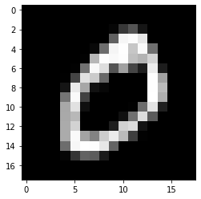
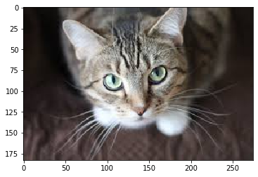
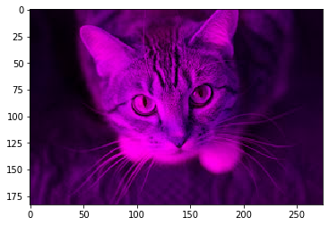
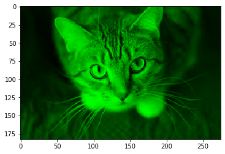
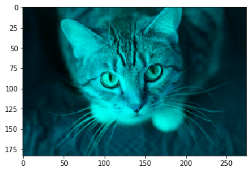

## Images in Python

In this blog, I will discuss basic image processing using python. 
Image processing is heavily used in day today life. 

In python, there are extensive set of libraries you could use to do image processing such as OpenCV, scikit-image, Python Imaging Library, and Pillow. In this article, we will focus on using open cv.

In this blog we will focus on reading images.

```python
from keras.datasets import mnist
import numpy as np
import cv2
import matplotlib.pyplot as plt
%matplotlib inline

```

    Using TensorFlow backend.


Downloading the MNIST data


```python
(x_train, _), (x_test, _) = mnist.load_data()
print("The shape of x_train dataset is", x_train.shape)
```

    Downloading data from https://s3.amazonaws.com/img-datasets/mnist.npz
    11493376/11490434 [==============================] - 56s 5us/step
    The shape of x_train dataset is (60000, 28, 28)


## Reading greyscale image
Loading first sample from MNIST dataset. Resizing the image to 18x18. 


```python
# selecting the first sample
x = x_train[1]
print("The dimension of x is 2D matrix as ", x.shape)
# Resizing the image
x = cv2.resize(x, (18,18))
```

    The dimension of x is 2D matrix as  (28, 28)


Plotting the image using Matplotlib


```python
plt.imshow(x, cmap='gray')
```


    <matplotlib.image.AxesImage at 0x7f4c2c742e10>





You can see that height and width of the matrix is 18x18, same as height and width of above image. So, each pixel is represented by number. 


```python
print("The range of pixel varies between 0 to 255")
print("The pixel having black is more close to 0 and pixel which is white is more close to 255")
print(x)
```

    The range of pixel varies between 0 to 255
    The pixel having black is more close to 0 and pixel which is white is more close to 255
    [[  0   0   0   0   0   0   0   0   0   0   0   0   0   0   0   0   0   0]
     [  0   0   0   0   0   0   0   0   0   0   0   0   0   0   0   0   0   0]
     [  0   0   0   0   0   0   0   0   0   6  55  84  22   0   0   0   0   0]
     [  0   0   0   0   0   0   0   0   0  96 244 250 228   0   0   0   0   0]
     [  0   0   0   0   0   0   0   9 108 243 252 196 247 110   0   0   0   0]
     [  0   0   0   0   0   0   2 181 252 247 251 189 178 210   0   0   0   0]
     [  0   0   0   0   0   2 112 247 220  84 159  69  30 234  29   0   0   0]
     [  0   0   0   0   1  68 223 201 103   0   0   0   0 252 160   0   0   0]
     [  0   0   0   0  21 232 166  17   7   0   0   0   0 252 184   0   0   0]
     [  0   0   0   0 116 248  65   0   0   0   0   0   0 253 172   0   0   0]
     [  0   0   0   0 167 223  15   0   0   0   0   2 107 225  33   0   0   0]
     [  0   0   0   0 168 182   0   0   0   0  16 111 219  90   0   0   0   0]
     [  0   0   0   0 169 208   0   0   0  30 207 217  18   0   0   0   0   0]
     [  0   0   0   0 169 248 162 130 202 234 184  62   2   0   0   0   0   0]
     [  0   0   0   0 108 245 253 251 229  99   0   0   0   0   0   0   0   0]
     [  0   0   0   0   5  52  98  91  26   0   0   0   0   0   0   0   0   0]
     [  0   0   0   0   0   0   0   0   0   0   0   0   0   0   0   0   0   0]
     [  0   0   0   0   0   0   0   0   0   0   0   0   0   0   0   0   0   0]]


## Reading colour image


```python
# Reading color image
cat = cv2.imread('cat.jpg')
plt.imshow(cv2.cvtColor(cat, cv2.COLOR_BGR2RGB))
```


    <matplotlib.image.AxesImage at 0x7f4c2c1e5a20>





```python
print('The shape of image is ', cat.shape)
```

    The shape of image is  (183, 275, 3)


### Plotting the RGB channels of the image. 


```python
cat_r  = cv2.imread('cat.jpg')
cat_r[:,:,1:2] = 0
plt.imshow(cat_r)
```


    <matplotlib.image.AxesImage at 0x7f4c2c151e48>





```python
cat_g  = cv2.imread('cat.jpg')
cat_g[:,:,(0,2)] = 0
plt.imshow(cat_g)
```


    <matplotlib.image.AxesImage at 0x7f4c2a8afa90>





```python
cat_b  = cv2.imread('cat.jpg')
cat_b[:,:,0:1] = 0
plt.imshow(cat_b)
```


    <matplotlib.image.AxesImage at 0x7f4c2a893668>





