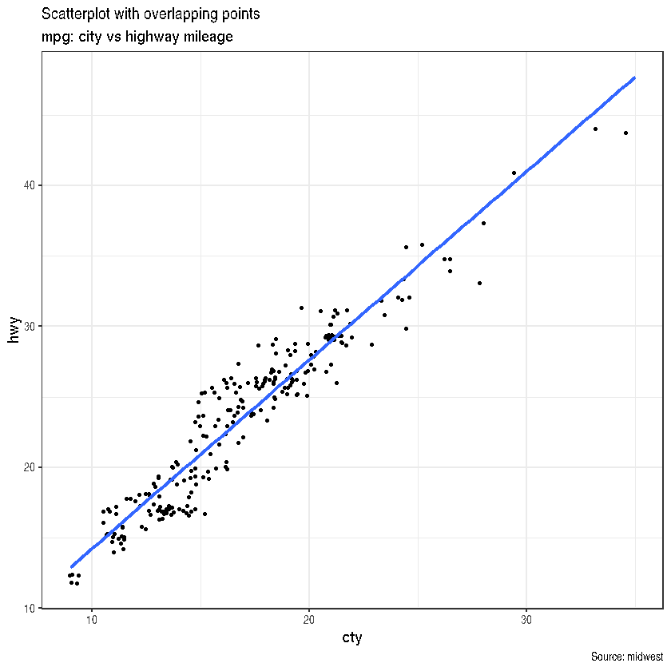
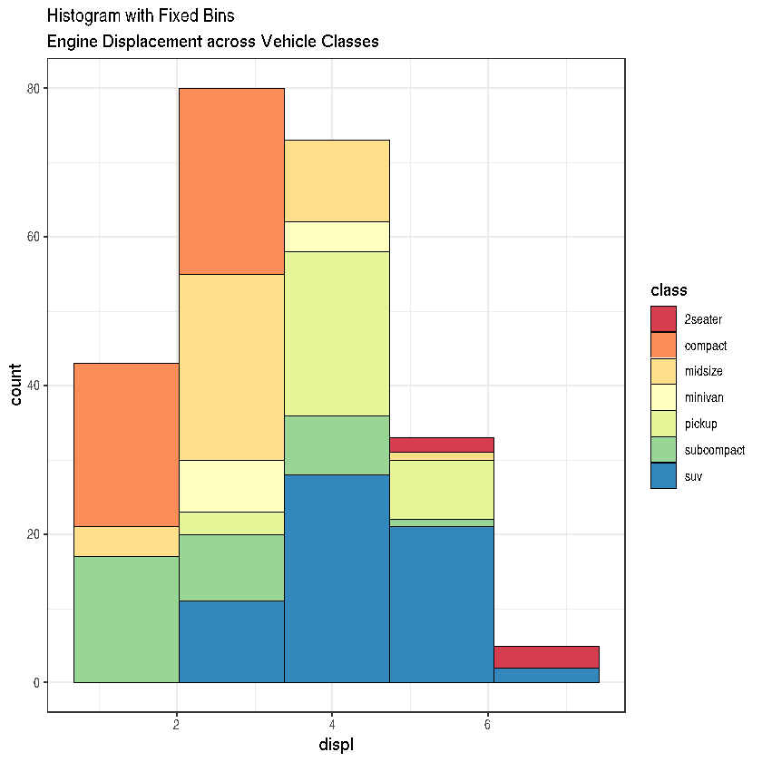

Without visualizations, it is impossible to communicate stories with the ever-increasing volume of data. The technique of transforming numbers into meaningful information is known as data visualization. Let's first examine how to choose the appropriate chart type before moving on to the technical aspects of the visualization.

A chart is considered effective if it:

    - Presents accurate information without falsifying facts.
2. Is lovely but simple. You shouldn't have to think too hard to understand it.
3. Information is not overshadowed by aesthetics; rather, it is supported.
4. Does not have too much information.
### Questions to ask when deciding which chart to use 
Q1. Do you want to compare values?

To create a comparison chart, use these types of graphs:

- Column
- Bar
- Circular Area 
- Line 
- Scatter Plot

Q2. Do you want to show the composition?

To show composition, use these charts:

- Stacked Bar
- Stacked Column
- Area

Q3. Do you want to understand the distribution of your data?

To show distributions, use these charts:

- Scatter plot
- Line
- Bar
- Column

Q3. Are you interested in analyzing trends in your data?

- Line
- Column

Q4. Do you want to understand the relationship between the variables in your dataset?

- Scatter plot
- Bubble
- Line

### Selecting the Right Chart Type
Primarily, there are 07 types of objectives you may construct plots. So, before you actually make the plot, try and figure what findings and relationships you would like to convey or examine through the visualization. Chances are it will fall under one (or sometimes more) of these 7 categories.

In your day-to-day activities, you’ll come across the below listed 7 charts most of the time.

1. Correlation
  + Scatterplot
  + Scatterplot With Encircling
  + Jitter Plot
  + Bubble Plot
  + Correlogram
2. Deviation
  + Diverging Bars
  + Area Chart
3. Ranking
  + Ordered Bar Chart
  + Dot Plot
4. Distribution
  + Histogram on a continuous variable
  + Histogram on a categorical variable
  + Density Plot
  + Box Plot
  + Dot + Box Plot
5. Composition
  + Bar Chart
6. Change
  + Time Series Plots
7. Groups
  + Dendrogram
  + Clusters

```R
options(scipen = 999) # turn-off scientific notation like 1e+48
library(ggplot2)
library(ggalt)
library(gapminder)
library(ggExtra)
library(ggcorrplot)
library(quantmod)
library(xts)
library(scales)
library(ggthemes)
library(lubridate)
library(ggdendro)
```

    Registered S3 methods overwritten by 'ggalt':
      method                  from   
      grid.draw.absoluteGrob  ggplot2
      grobHeight.absoluteGrob ggplot2
      grobWidth.absoluteGrob  ggplot2
      grobX.absoluteGrob      ggplot2
      grobY.absoluteGrob      ggplot2
    
    Loading required package: xts
    
    Loading required package: zoo
    
    
    Attaching package: ‘zoo’
    
    
    The following objects are masked from ‘package:base’:
    
        as.Date, as.Date.numeric
    
    
    Loading required package: TTR
    
    Registered S3 method overwritten by 'quantmod':
      method            from
      as.zoo.data.frame zoo 
    
    
    Attaching package: ‘lubridate’
    
    
    The following objects are masked from ‘package:base’:
    
        date, intersect, setdiff, union
    
    

Set the background theme.

```R
theme_set(theme_bw())  # pre-set the bw theme.
```

### 1. Correlation

#### A. Scatter Plot
**When to use**: Scatter Plot is used to see the relationship between two continuous variables.

It can be drawn using `geom_point()`. Additionally, `geom_smooth` which draws a smoothing line (based on loess) by default, can be tweaked to draw the line of best fit by setting `method='lm'`.

```R
data("midwest", package = "ggplot2")
# midwest <- read.csv("https://goo.gl/WtBMC3")  # backup data source

# Scatterplot
gg <- ggplot(midwest, aes(x=area, y=poptotal)) + 
  geom_point(aes(col=state, size=popdensity)) + 
  geom_smooth(method="loess", se=F) + 
  coord_cartesian(ylim = c(0, 500000))+ 
  labs(subtitle="Area Vs Population", 
       y="Population", 
       x="Area", 
       title="Scatterplot", 
       caption = "Source: midwest")

plot(gg)
```

    `geom_smooth()` using formula = 'y ~ x'


    

    

A categorical variable can be used in a scatterplot to demonstrate the characteristics of the depicted variables. So, the above code can be updated as follows.
#### B. Scatterplot With Encircling
When displaying the data, I would sometimes encircle a certain set of points or location in the chart to attract emphasis to such unusual cases. This is easily accomplished by calling the 'geom_encircle()' function in the 'ggalt' package.

Within 'geom_encircle()', assign the 'data' to a new dataframe containing only the points (rows) of interest. Furthermore, you can 'stretch' the curve to pass just outside of the points. You can also change the curve's 'color' and'size' (thickness). See the following example.

```R
midwest_select <- midwest[midwest$poptotal > 350000 & 
                            midwest$poptotal <= 500000 & 
                            midwest$area > 0.01 & 
                            midwest$area < 0.1, ]

# Plot
ggplot(midwest, aes(x=area, y=poptotal)) + 
  geom_point(aes(col=state, size=popdensity)) +   # draw points
  geom_smooth(method="loess", se=F) + 
  #xlim(c(0, 0.6)) + 
  #ylim(c(0, 500000)) +   # draw smoothing line
  coord_cartesian(ylim = c(0, 500000))+
  geom_encircle(aes(x=area, y=poptotal), 
                data=midwest_select, 
                color="red", 
                size=2, 
                expand=0.06) +   # encircle
  labs(subtitle="Area Vs Population", 
       y="Population", 
       x="Area", 
       title="Scatterplot + Encircle", 
       caption="Source: midwest")

```

    `geom_smooth()` using formula = 'y ~ x'


    

    


#### C. Jitter Plot
Let's look at new data to create a scatterplot. This time, I'll utilize the'mpg' dataset to compare city mileage ('cty') with highway mileage ('hwy').

```R
g <- ggplot(data=mpg, aes(cty, hwy))

# Scatterplot
g + geom_jitter(width = 0.5, size=1) + 
  geom_smooth(method="lm", se=F) +
  labs(subtitle="mpg: city vs highway mileage", 
       y="hwy", 
       x="cty", 
       title="Scatterplot with overlapping points", 
       caption="Source: midwest")
```

    `geom_smooth()` using formula = 'y ~ x'


    

    


### Bubble Plot
Bubble charts are useful for understanding relationships within the underlying groupings, while scatterplots allow you to compare the relationship between two continuous variables based on:

One continuous variable (by altering the size of the dots) and one categorical variable (by altering the color).

To put it another way, bubble charts work best with 4-dimensional data that has two numeric variables (X and Y), one category variable (color), and one numeric variable (size).

```R
mpg_select <- mpg[mpg$manufacturer %in% c("audi", "ford", "honda", "hyundai"), ]

# Scatterplot
g <- ggplot(mpg_select, aes(displ, cty)) + 
  labs(subtitle="mpg: Displacement vs City Mileage",
       title="Bubble chart")

g + geom_jitter(aes(col=manufacturer, size=hwy)) + 
  geom_smooth(aes(col=manufacturer), method="lm", se=F)
```

    `geom_smooth()` using formula = 'y ~ x'


    

    


#### E. Correlogram

Correlogram let’s you `examine the correlation` of `multiple continuous variables` present in the same dataframe. This is conveniently implemented using the `ggcorrplot` package.

```R
# Correlation matrix
data(mtcars)
corr <- round(cor(mtcars), 1)

# Plot
ggcorrplot(corr, hc.order = TRUE, 
           type = "lower", 
           lab = TRUE, 
           lab_size = 3, 
           method="circle", 
           colors = c("tomato2", "white", "springgreen3"), 
           title="Correlogram of mtcars", 
           ggtheme=theme_bw)

```


    

    


#### F. Diverging Bars
A bar chart that can accommodate both positive and negative numbers is called a diverging bar chart. This may be accomplished with a clever modification using `geom_bar()`. However, using `geom_bar()` can be a little perplexing. This is because it may be used to create both a histogram and a bar chart. Let me clarify.

`geom_bar()` has the stat set to count by default. This indicates that it attempts to create a histogram from the data when you provide it only a continuous X variable (and no Y variable).

For creating a bar chart You must do two things in order to make bars rather than a histogram.

1. Configure `stat=identity`

2. Provide both `x` and `y` inside `aes()`, where y is a numeric and x is either `character` or `factor`.
Make sure your categorical variable has two categories that change values at a specific threshold of the continuous variable to ensure you receive diverging bars rather than merely bars. The mpg from the mtcars dataset is normalized in the example below by calculating the z score. Green cars are those with mpg over zero, and red cars are those with mpg below 0.

```R
data("mtcars")  # load data
mtcars$`car name` <- rownames(mtcars)  # create new column for car names
mtcars$mpg_z <- round((mtcars$mpg - mean(mtcars$mpg))/sd(mtcars$mpg), 2)  # compute normalized mpg
mtcars$mpg_type <- ifelse(mtcars$mpg_z < 0, "below", "above")  # above / below avg flag
mtcars <- mtcars[order(mtcars$mpg_z), ]  # sort
mtcars$`car name` <- factor(mtcars$`car name`, levels = mtcars$`car name`)  # convert to factor to retain sorted order in plot.

# Diverging Barcharts
ggplot(mtcars, aes(x=`car name`, y=mpg_z, label=mpg_z)) + 
  geom_bar(stat='identity', aes(fill=mpg_type), width=.5)  +
  scale_fill_manual(name="Mileage", 
                    labels = c("Above Average", "Below Average"), 
                    values = c("above"="#00ba38", "below"="#f8766d")) + 
  labs(subtitle="Normalised mileage from 'mtcars'", 
       title= "Diverging Bars") + 
  coord_flip()
```


    

    


#### G. Area Chart
Area charts are typically used to visualize how a particular metric (such as % returns from a stock) performed compared to a certain baseline. Other types of %returns or %change data are also commonly used. The `geom_area()` implements this.

```R
data("economics", package = "ggplot2")

# Compute % Returns
economics$returns_perc <- c(0, diff(economics$psavert)/economics$psavert[-length(economics$psavert)])

# Create break points and labels for axis ticks
brks <- economics$date[seq(1, length(economics$date), 12)]
lbls <- lubridate::year(economics$date[seq(1, length(economics$date), 12)])

# Plot
ggplot(economics[1:100, ], aes(date, returns_perc)) + 
  geom_area() + 
  scale_x_date(breaks=brks, labels=lbls) + 
  theme(axis.text.x = element_text(angle=90)) + 
  labs(title="Area Chart", 
       subtitle = "Perc Returns for Personal Savings", 
       y="% Returns for Personal savings", 
       caption="Source: economics")

```


    

    


### 3. Ranking
Used to compare the position or performance of multiple items with respect to each other. Actual values matters somewhat less than the ranking.
#### H. Ordered Bar Chart
Ordered Bar Chart is a Bar Chart that is ordered by the Y axis variable. Just sorting the dataframe by the variable of interest isn’t enough to order the bar chart. In order for the bar chart to retain the order of the rows, the X axis variable (i.e. the categories) has to be converted into a factor.

Let’s plot the mean city mileage for each manufacturer from mpg dataset. First, aggregate the data and sort it before you draw the plot. Finally, the X variable is converted to a factor.


```R
cty_mpg <- aggregate(mpg$cty, by=list(mpg$manufacturer), FUN=mean)  # aggregate
colnames(cty_mpg) <- c("make", "mileage")  # change column names
cty_mpg <- cty_mpg[order(cty_mpg$mileage), ]  # sort
cty_mpg$make <- factor(cty_mpg$make, levels = cty_mpg$make)  # to retain the order in plot.
head(cty_mpg, 4)
```


<table class="dataframe">
<caption>A data.frame: 4 × 2</caption>
<thead>
	<tr><th></th><th scope=col>make</th><th scope=col>mileage</th></tr>
	<tr><th></th><th scope=col>&lt;fct&gt;</th><th scope=col>&lt;dbl&gt;</th></tr>
</thead>
<tbody>
	<tr><th scope=row>9</th><td>lincoln   </td><td>11.33333</td></tr>
	<tr><th scope=row>8</th><td>land rover</td><td>11.50000</td></tr>
	<tr><th scope=row>3</th><td>dodge     </td><td>13.13514</td></tr>
	<tr><th scope=row>10</th><td>mercury   </td><td>13.25000</td></tr>
</tbody>
</table>


The X variable is now a factor, let’s plot.

```R
# Draw plot
ggplot(cty_mpg, aes(x=make, y=mileage)) + 
  geom_bar(stat="identity", width=.5, fill="tomato3") + 
  labs(title="Ordered Bar Chart", 
       subtitle="Make Vs Avg. Mileage", 
       caption="source: mpg") + 
  theme(axis.text.x = element_text(angle=65, vjust=0.6))
```


    

    


#### I. Dot Plot
Dot plots emphasizes more on the rank ordering of items with respect to actual values and how far apart are the entities with respect to each other.

```R
# Plot
ggplot(cty_mpg, aes(x=make, y=mileage)) + 
  geom_point(col="tomato2", size=3) +   # Draw points
  geom_segment(aes(x=make, 
                   xend=make, 
                   y=min(mileage), 
                   yend=max(mileage)), 
               linetype="dashed", 
               size=0.1) +   # Draw dashed lines
  labs(title="Dot Plot", 
       subtitle="Make Vs Avg. Mileage", 
       caption="source: mpg") +  
  coord_flip()
```

    Warning message:
    “Using `size` aesthetic for lines was deprecated in ggplot2 3.4.0.
    ℹ Please use `linewidth` instead.”


    

    


### 4. Distribution
When you have lots and lots of data points and want to study where and how the data points are distributed.
##### J. Histogram on a continuous variable
Histogram on a continuous variable can be accomplished using either `geom_bar()` or `geom_histogram()`. When using `geom_histogram()`, you can control the number of bars using the `bins` option. Else, you can set the range covered by each bin using `binwidth`. The value of binwidth is on the same scale as the continuous variable on which histogram is built. Since, `geom_histogram` gives facility to control both number of `bins` as well as `binwidth`, it is the preferred option to create histogram on continuous variables.

```R
# Histogram on a Continuous (Numeric) Variable
g <- ggplot(mpg, aes(displ)) + scale_fill_brewer(palette = "Spectral")

g + geom_histogram(aes(fill=class), 
                   binwidth = .1, 
                   col="black", 
                   size=.1) +  # change binwidth
  labs(title="Histogram with Auto Binning", 
       subtitle="Engine Displacement across Vehicle Classes")  

g + geom_histogram(aes(fill=class), 
                   bins=5, 
                   col="black", 
                   size=.1) +   # change number of bins
  labs(title="Histogram with Fixed Bins", 
       subtitle="Engine Displacement across Vehicle Classes") 
```


    

    


    

    


#### K. Histogram on a categorical variable
Histogram on a categorical variable would result in a frequency chart showing bars for each category. By adjusting width, you can adjust the thickness of the bars.

```R
g <- ggplot(mpg, aes(manufacturer))
g + geom_bar(aes(fill=class), width = 0.5) + 
  theme(axis.text.x = element_text(angle=65, vjust=0.6)) + 
  labs(title="Histogram on Categorical Variable", 
       subtitle="Manufacturer across Vehicle Classes") 
```


    

    


#### L. Density Plot


```R
g <- ggplot(mpg, aes(cty))
g + geom_density(aes(fill=factor(cyl))) + 
    labs(title="Density plot", 
         subtitle="City Mileage Grouped by Number of cylinders",
         caption="Source: mpg",
         x="City Mileage",
         fill="# Cylinders")

```


    

    


#### M. Box Plot
Box plot is an excellent tool to study the distribution. It can also show the distributions within multiple groups, along with the median, range and outliers if any.

The dark line inside the box represents the median. The top of box is 75%ile and bottom of box is 25%ile. The end points of the lines (aka whiskers) is at a distance of 1.5*IQR, where IQR or Inter Quartile Range is the distance between 25th and 75th percentiles. The points outside the whiskers are marked as dots and are normally considered as extreme points.

Setting `varwidth=T` adjusts the width of the boxes to be proportional to the number of observation it contains.

```R
g <- ggplot(mpg, aes(class, cty))
g + geom_boxplot(varwidth=T, fill="plum") + 
    labs(title="Box plot", 
         subtitle="City Mileage grouped by Class of vehicle",
         caption="Source: mpg",
         x="Class of Vehicle",
         y="City Mileage")
```


    

    


#### N. Dot + Box Plot
On top of the information provided by a box plot, the dot plot can provide more clear information in the form of summary statistics by each group. The dots are staggered such that each dot represents one observation. So, in below chart, the number of dots for a given manufacturer will match the number of rows of that manufacturer in source data.

```R
g <- ggplot(mpg, aes(manufacturer, cty))
g + geom_boxplot() + 
  geom_dotplot(binaxis='y', 
               stackdir='center', 
               dotsize = .5, 
               fill="red") +
  theme(axis.text.x = element_text(angle=65, vjust=0.6)) + 
  labs(title="Box plot + Dot plot", 
       subtitle="City Mileage vs Class: Each dot represents 1 row in source data",
       caption="Source: mpg",
       x="Class of Vehicle",
       y="City Mileage")
```

    Bin width defaults to 1/30 of the range of the data. Pick better value with `binwidth`.


    

    


### 5. Composition

#### O. Bar Chart
By default, `geom_bar()` has the `stat` set to `count`. That means, when you provide just a continuous X variable (and no Y variable), it tries to make a histogram out of the data.

In order to make a bar chart create bars instead of histogram, you need to do two things.

a. Set `stat=identity`
b. Provide both `x` and `y` inside `aes()` where, `x` is either `character` or `factor` and `y` is `numeric`.

```R
freqtable <- table(mpg$manufacturer)
df <- as.data.frame.table(freqtable)
head(df)
```


<table class="dataframe">
<caption>A data.frame: 6 × 2</caption>
<thead>
	<tr><th></th><th scope=col>Var1</th><th scope=col>Freq</th></tr>
	<tr><th></th><th scope=col>&lt;fct&gt;</th><th scope=col>&lt;int&gt;</th></tr>
</thead>
<tbody>
	<tr><th scope=row>1</th><td>audi     </td><td>18</td></tr>
	<tr><th scope=row>2</th><td>chevrolet</td><td>19</td></tr>
	<tr><th scope=row>3</th><td>dodge    </td><td>37</td></tr>
	<tr><th scope=row>4</th><td>ford     </td><td>25</td></tr>
	<tr><th scope=row>5</th><td>honda    </td><td> 9</td></tr>
	<tr><th scope=row>6</th><td>hyundai  </td><td>14</td></tr>
</tbody>
</table>


```R
g <- ggplot(df, aes(Var1, Freq))
g + geom_bar(stat="identity", width = 0.5, fill="tomato2") + 
      labs(title="Bar Chart", 
           subtitle="Manufacturer of vehicles", 
           caption="Source: Frequency of Manufacturers from 'mpg' dataset") +
      theme(axis.text.x = element_text(angle=65, vjust=0.6))
```


    

    

It can be computed directly from a column variable as well. In this case, only X is provided and `stat=identity` is not set.

```R
g <- ggplot(mpg, aes(manufacturer))
g + geom_bar(aes(fill=class), width = 0.5) + 
  theme(axis.text.x = element_text(angle=65, vjust=0.6)) +
  labs(title="Categorywise Bar Chart", 
       subtitle="Manufacturer of vehicles", 
       caption="Source: Manufacturers from 'mpg' dataset")
```


    

    


### 6. Change

#### P. Time Series Plots
Time Series Plot From a Data Frame

Using `geom_line()`, a time series (or line chart) can be drawn from a data.frame as well.

```R
ggplot(economics, aes(x=date)) + 
  geom_line(aes(y=returns_perc)) + 
  labs(title="Time Series Chart", 
       subtitle="Returns Percentage from 'Economics' Dataset", 
       caption="Source: Economics", 
       y="Returns %")
```


    

    


### 7. Groups

#### Q. Hierarchical Dendrogram


```R
library(ggplot2)
library(ggdendro)
hc <- hclust(dist(USArrests), "ave")  # hierarchical clustering
# plot
ggdendrogram(hc, rotate = TRUE, size = 2)
```


    

    


#### R. Clusters

It is possible to show the distinct clusters or groups using `geom_encircle()`. If the dataset has multiple weak features, you can compute the principal components and draw a scatterplot using PC1 and PC2 as X and Y axis.

The `geom_encircle()` can be used to encircle the desired groups. The only thing to note is the data argument to `geom_circle()`. You need to provide a subsetted dataframe that contains only the observations (rows) that belong to the group as the data argument.

```R
library(ggplot2)
library(ggalt)
library(ggfortify)

# Compute data with principal components 
df <- iris[c(1, 2, 3, 4)]
pca_mod <- prcomp(df)  # compute principal components

# Data frame of principal components 
df_pc <- data.frame(pca_mod$x, Species=iris$Species)  # dataframe of principal components
df_pc_vir <- df_pc[df_pc$Species == "virginica", ]  # df for 'virginica'
df_pc_set <- df_pc[df_pc$Species == "setosa", ]  # df for 'setosa'
df_pc_ver <- df_pc[df_pc$Species == "versicolor", ]  # df for 'versicolor'
 
# Plot 
ggplot(df_pc, aes(PC1, PC2, col=Species)) + 
  geom_point(aes(shape=Species), size=2) +   # draw points
  labs(title="Iris Clustering", 
       subtitle="With principal components PC1 and PC2 as X and Y axis",
       caption="Source: Iris") + 
  coord_cartesian(xlim = 1.2 * c(min(df_pc$PC1), max(df_pc$PC1)), 
                  ylim = 1.2 * c(min(df_pc$PC2), max(df_pc$PC2))) +   
  # change axis limits
  geom_encircle(data = df_pc_vir, aes(x=PC1, y=PC2)) +   
  # draw circles
  geom_encircle(data = df_pc_set, aes(x=PC1, y=PC2)) + 
  geom_encircle(data = df_pc_ver, aes(x=PC1, y=PC2))
```

    Registered S3 method overwritten by 'ggfortify':
      method        from 
      fortify.table ggalt
    


    

    


```R

```
